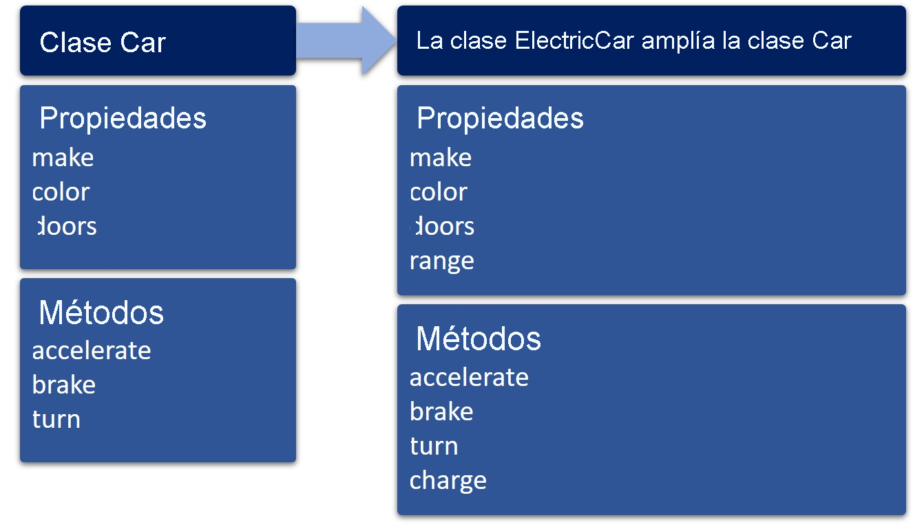

# Clases tn TypeScript

## Tabla de Contenidos

- [Introduccion a Clases](#introduccin-a-las-clases-de-typescript)
- [Componentes de Clase](#componentes-de-clase)
- [Notas de Diseño](#notas-de-diseo)
- Diseño e Implementacion de una Clase
  - [Creacion de una Clase](#creacin-de-una-clase)
  - [Propiedades de una Clase](#declaracin-de-las-propiedades-de-clase)
  - [Constructor de una Clase](#definicin-del-constructor-de-la-clase)
  - [Descriptores de Acceso](#definicin-de-los-descriptores-de-acceso)
  - [Metodos de una Clase](#definicin-de-los-mtodos-de-clase)
  - [Creacion de una Instancia](#creacin-de-instancias-de-una-clase)
  - [Modificadores de Acceso](#modificadores-de-acceso)
  - [Propiedades Estaticas](#definicin-de-propiedades-estticas)
- [Herencia de Clases](#ampliacin-de-una-clase-mediante-herencia)
  - [Invalidacion de un Metodo](#invalidacin-de-un-mtodo)
  - [Ampliacion de Clase](#ampliacin-de-una-clase)
  - [Declaracion de Interfaz](#declaracin-de-una-interfaz-para-asegurar-la-forma-de-la-clase)

### Introducción a las clases de TypeScript

Las clases permiten expresar patrones comunes orientados a objetos de una manera estándar, haciendo que características como la herencia sean más legibles e interoperables. En TypeScript, las clases son otra forma de definir la forma de un objeto, además de describir los tipos de objetos con interfaces y funciones.

Si no ha trabajado con clases, puede que le resulte útil revisar algunos conceptos básicos.

Puede pensar en una clase como un plano técnico para crear objetos, como un automóvil. Una clase Car describe los atributos de un automóvil, por ejemplo, la marca, el color o el número de puertas. También describe los comportamientos que puede realizar el automóvil, como acelerar, frenar o girar.

Pero la clase Car es simplemente un plan para construir un automóvil. Debe crear una instancia de Car a partir de la clase Car antes de que se convierta en un objeto al que puede asignar valores de propiedad (como establecer el color en azul) o llamar a sus comportamientos (como la aplicación de los frenos).

La clase Car se puede volver a usar para crear cualquier número de objetos Car nuevos, cada uno con sus propias características. También puede ampliar la clase Car. Por ejemplo, una clase ElectricCar podría ampliar el valor de Car. Tendrá todos los mismos atributos y comportamientos de Car pero también puede tener sus propios atributos y comportamientos únicos, como su alcance y una operación de carga.



La clase Car incluye las propiedades make, color y doors y los métodos accelerate, brake y turn. Cuando la clase ElectricCar amplía a Car, incluye todas las propiedades y los métodos de Car, además de una nueva propiedad denominada range y un nuevo método denominado charge.

Una clase encapsula datos para el objeto. Los datos y el comportamiento se incluyen en la clase, pero los detalles de ambos pueden quedar ocultos para la persona que trabaja con el objeto en código. Por ejemplo, si llama al método turn de un objeto Car, no necesita saber exactamente cómo funciona el volante, solo necesita saber que el coche girará a la izquierda cuando se lo indique. La clase sirve como una caja negra en la que todos los atributos y comportamientos solo se exponen a través de las propiedades y los métodos, limitando lo que un codificador puede hacer con ella.

> Sugerencia
>
> Si desea profundizar en los conceptos de la programación orientada a objetos con más detalle, vea el vídeo sobre aspectos básicos de las clases.

### Componentes de clase

- Las propiedades, también denominadas campos, son los datos (o atributos) del objeto. Estas son las características que definen el objeto y que puede establecer o devolver desde el código.
- `constructor` es una función especial que se usa para crear e inicializar objetos basados en la clase. Cuando se crea una nueva instancia de la clase, el constructor crea un nuevo objeto con la forma de clase y lo inicializa con los valores que se le han pasado.
- Los descriptores de acceso son un tipo de función que se usa para aplicar get o set al valor de las propiedades. Las propiedades pueden ser de solo lectura simplemente omitiendo el descriptor de acceso set en la clase, o inaccesibles omitiendo el descriptor de acceso get (la propiedad devolverá undefined si se intenta acceder a ella, incluso si se le asigna un valor durante la inicialización).
- Los métodos son funciones que definen los comportamientos o acciones que puede realizar el objeto. Puede llamar a estos métodos para invocar el comportamiento del objeto. También se pueden definir métodos a los que solo se puede tener acceso desde dentro de la propia clase y a los que otros métodos de la clase llaman normalmente para realizar una tarea.

### Notas de diseño
Puede crear clases para modelar datos, encapsular funcionalidades o proporcionar plantillas, entre otras muchas opciones. Por lo tanto, los componentes enumerados anteriormente no son necesarios en cada clase que se cree. Puede que solo necesite métodos y un constructor para un objeto de utilidad, o únicamente propiedades para administrar los datos.

> Nota
>
> Normalmente, los descriptores de acceso solo se usan cuando es necesario controlar el acceso a los valores, como implementar la validación o calcular los valores dinámicamente. Si la clase almacena valores estrictamente y no necesita la funcionalidad adicional proporcionada por los descriptores de acceso, puede usar las propiedades.

### Creación de una clase

Para crear una clase, defina sus miembros: propiedades, un elemento constructor, descriptores de acceso y métodos.

Vamos a crear una clase denominada Car. Puede utilizar la clase Car por sí sola para crear objetos básicos Car, o puede ampliar la clase Car para crear nuevas clases para tipos específicos de vehículos, como una clase GasCar o una clase ElectricCar. Estas clases heredarán las propiedades y métodos de la clase Car, pero también tendrán sus propias propiedades y métodos.

1. Abra el área de juegos y quite cualquier código existente.
2. Cree una nueva class mediante la palabra clave class y el nombre de clase, Car. Por convención, los nombres de clase están en PascalCase. Vamos a agregar también algunos comentarios para que sea más fácil agregar los miembros de la clase en los lugares correctos.
    ````typescript
    class Car {
        // Properties

        // Constructor

        // Accessors

        // Methods

    }
    ````

### Declaración de las propiedades de clase
Puede pensar en las propiedades de una clase como los datos sin procesar que se pasan al objeto cuando se inicializa.

Las propiedades de la clase Car son las que se aplican a cualquier automóvil, independientemente de la marca o el modelo. Por ejemplo, estas propiedades pueden incluir la marca del coche, el color y el número de puertas. Dado que está trabajando en TypeScript, también puede aplicar atributos de tipo a las propiedades.

1. Declare las tres propiedades de la clase Car: _model: string, _color: string y _doors: number.
    ```typescript
    // Properties
    _make: string;
    _color: string;
    _doors: number;
    ```

### Definición del constructor de la clase
Las clases de TypeScript crean dos tipos independientes: el tipo de instancia, que define qué miembros tiene una instancia de una clase, y el tipo de función constructor, que define qué miembros tiene la función de clase constructor. El tipo de función constructor también se conoce como el tipo "lado estático" porque incluye miembros estáticos de la clase.

El uso de constructor puede simplificar las clases y facilitar su administración cuando se trabaja con muchas clases.

Una función constructor inicializa las propiedades de la clase y tiene tres partes:

- La palabra clave constructor.
- Una lista de parámetros, que define los parámetros que se pasarán al nuevo objeto cuando se crea una nueva instancia. Al definir la lista de parámetros, recuerde que:
  - No es necesario definir un parámetro para cada propiedad de la clase.
  - Como con todas las funciones de TypeScript, los parámetros pueden ser obligatorios u opcionales, tener valores predeterminados o ser parámetros de REST. (Esta es una diferencia clave de JavaScript).
  - Los nombres de los parámetros pueden ser diferentes de los nombres de propiedad. Tenga en cuenta que estos nombres aparecerán en IntelliSense al trabajar con objetos de este tipo, por lo que debe usar nombres suficientemente descriptivos.
- Las asignaciones de propiedades. Cada instrucción asigna el valor de un parámetro al valor de una propiedad. Para indicar que va a acceder a un miembro de la clase (en este caso, la propiedad), aplique la palabra clave this..

Una clase puede contener como máximo una declaración constructor. Si una clase no contiene ninguna declaración constructor, se proporciona un constructor automático.

Siga definiendo la clase Car en el área de juegos.

1. Cree el elemento constructor para la clase Car. Comience con la palabra clave constructor y, a continuación, defina los parámetros y tipos que se pasarán al nuevo objeto Car cuando se cree una nueva instancia. Para la clase Car, defina un parámetro para cada una de las tres propiedades y anótelo con el tipo. Haga que el parámetro doors sea opcional con un valor predeterminado de 4.
2. Dentro del bloque de código para constructor, asigne un valor de parámetro a cada propiedad (por ejemplo, this._make = make). En este caso, establézcalo en el valor del parámetro asociado, pero tenga en cuenta que puede asignar cualquier expresión que devuelva el tipo necesario.
    ````typescript
    // Constructor
    constructor(make: string, color: string, doors = 4) {
        this._make = make;
        this._color = color;
        this._doors = doors;
    }
    ````

> Sugerencia
>
> El carácter de subrayado (_) antes del nombre de la propiedad no es necesario en la declaración de propiedad, pero proporciona una manera de distinguir la declaración de propiedad de los parámetros a los que se puede tener acceso a través del constructor, manteniendo un enlace visual entre ellos.

### Definición de los descriptores de acceso

Aunque puede acceder directamente a las propiedades de la clase (public de forma predeterminada), TypeScript admite captadores y establecedores como una forma de interceptar el acceso a una propiedad. Esto le proporciona un control más preciso sobre cómo se tiene acceso a un miembro en cada objeto.

Para aplicar set o devolver el valor de los miembros del objeto desde el código, debe definir los descriptores de acceso get y set en la clase.

Siga definiendo la clase Car en el área de juegos.

1. Defina un bloque get para el parámetro make que devuelve el valor de la propiedad _make.
    ````typescript
    // Accessors
    get make() {
        return this._make;
    }
    ````
2. Define un bloque set para el parámetro make que establece el valor de la propiedad _make en el valor del parámetro make.
   ````typescript
    set make(make) {
        this._make = make;
    }
    ````
3. También puede utilizar los bloques get y set para validar los datos, imponer restricciones o realizar otras manipulaciones de los datos antes de devolverlos al programa. Defina los bloques get y set para el parámetro color pero, esta vez, devuelva una cadena concatenada al valor de la propiedad _color.
    ````typescript
    get color() {
        return 'The color of the car is ' + this._color;
    }
    set color(color) {
        this._color = color;
    }
    ````
4. Defina los bloques get y set para el parámetro doors. Antes de devolver el valor de la propiedad _doors, verifique que el valor del parámetro doors es un número par. Si no es así, se produce un error.
    ````typescript
    get doors() {
        return this._doors;
    }
    set doors(doors) {
        if ((doors % 2) === 0) {
            this._doors = doors;
        } else {
            throw new Error('Doors must be an even number');
        }
    }
    ````

### Definición de los métodos de clase
Puede definir cualquier función de TypeScript dentro de una clase y llamarla como un método en el objeto o desde otras funciones dentro de la clase. Estos miembros de la clase describen los comportamientos que su clase puede realizar y pueden realizar cualquier otra tarea requerida por la clase.

Siga definiendo la clase Car en el área de juegos.

1. Defina estos cuatro métodos para la clase Car: accelerate, brake, turn y worker. Observará que no hay ninguna palabra clave function. Esto no es necesario ni se permite al definir funciones en una clase, por lo que ayuda a mantener la sintaxis concisa.
    ````typescript
    // Methods
    accelerate(speed: number): string {
        return `${this.worker()} is accelerating to ${speed} MPH.`
    }
    brake(): string {
        return `${this.worker()} is braking with the standard braking system.`
    }
    turn(direction: 'left' | 'right'): string {
        return `${this.worker()} is turning ${direction}`;
    }
    // This function performs work for the other method functions
    worker(): string {
        return this._make;
    }
    ````

### Creación de instancias de una clase

En este punto, tiene una clase denominada Car que tiene tres propiedades, y puede obtener y establecer el valor de esas propiedades. También tiene cuatro métodos. Ahora, puede crear una instancia de la clase Car con la palabra clave new y pasarle parámetros, creando un nuevo objeto Car.

Continúe trabajando en el área de juegos.

1. Debajo de la declaración de clase, declare una variable denominada myCar1 y asígnele un nuevo objeto Car, pasando valores para los parámetros make, color y doors (asegúrese de que el parámetro doors tiene asignado un número par).
    ````typescript
    let myCar1 = new Car('Cool Car Company', 'blue', 2);  // Instantiates the Car object with all parameters
    ````
2. Puede tener acceso a las propiedades del nuevo objeto myCar1. Escriba myCar1. y debería ver una lista de los miembros definidos en la clase, incluidos color y _color. Seleccione Ejecutar para devolver el valor de ambas propiedades a la consola. ¿Qué sucede? ¿Por qué?
    ````typescript
    console.log(myCar1.color);
    console.log(myCar1._color);
    ````
3. El miembro _color representa la propiedad definida en la clase, mientras que color es el parámetro que se pasa al constructor. Cuando se hace referencia a _color, se obtiene acceso a los datos sin procesar de la propiedad, que devuelve 'blue'. Cuando se hace referencia a color, se obtiene acceso a la propiedad a través del descriptor de acceso get o set, que devuelve 'The color of the car is blue'. Es importante comprender la diferencia entre los dos porque a menudo no se quiere permitir el acceso directo a la propiedad sin hacer alguna validación u otro trabajo en los datos antes de obtenerlos o establecerlos. Aprenderá a usar modificadores de acceso para controlar la visibilidad de los miembros de la clase más adelante en la unidad.
4. Recuerde que el bloque set del parámetro doors comprueba el valor para determinar si es par o impar. Para probarlo, declare una variable denominada myCar2 y asígnele un nuevo objeto Car, pasando valores para los parámetros make, color y doors. Esta vez, establezca el valor del parámetro doors en un número impar. Ahora, seleccione Ejecutar. ¿Qué sucede? ¿Por qué?
    ````typescript
    let myCar2 = new Car('Galaxy Motors', 'red', 3);
    ````
5. Aunque se pasó un número impar a doors, se compila y se ejecuta sin errores porque no se realiza ninguna validación de datos en constructor. Pruebe a establecer el valor de doors en otro número impar (por ejemplo, myCar2.doors = 5) y pruébelo. Así, se debería invocar al bloque set y producirse un error. Si desea realizar este paso de validación cuando se inicializa el objeto Car, debe agregar una comprobación de validación a constructor.
    ````typescript
    constructor(make: string, color: string, doors = 4) {
      this._make = make;
      this._color = color;
      if ((doors % 2) === 0) {
        this._doors = doors;
      } else {
        throw new Error('Doors must be an even number');
      }
    }
    ````
6. Pruebe el parámetro opcional doors omitiéndolo en la inicialización del objeto.
    ````typescript
    let myCar3 = new Car('Galaxy Motors', 'gray');
    console.log(myCar3.doors);  // returns 4, the default value
    ````
7. Pruebe los métodos enviando los valores devueltos a la consola.
    ````typescript
    console.log(myCar1.accelerate(35));
    console.log(myCar1.brake());
    console.log(myCar1.turn('right'));
    ````

### Modificadores de acceso

De forma predeterminada, todos los miembros de clase son de tipo public. Esto significa que son accesibles desde fuera de la clase contenedora. Vio un ejemplo de esto anteriormente cuando devolvía el valor de dos miembros de la clase Car: _color (una propiedad definida en la clase) y color (un parámetro definido en constructor). A veces, es deseable proporcionar acceso a ambos, pero normalmente querrá controlar el acceso a los datos sin procesar contenidos en la propiedad permitiendo solo el acceso a través del descriptor de acceso get o set.

También puede controlar el acceso a las funciones de método. Por ejemplo, la clase Car contiene una función llamada worker a la que solo se llama desde otras funciones de método dentro de la clase. Llamar a esta función directamente desde fuera de la clase puede provocar resultados no deseados.

En TypeScript, puede controlar la visibilidad de los miembros de la clase agregando la palabra clave public, private o protected antes del nombre del miembro.

| Modificador de acceso | Descripción                                                                                                                                                                                                                                                                     |
|-----------------------|---------------------------------------------------------------------------------------------------------------------------------------------------------------------------------------------------------------------------------------------------------------------------------|
| public                | Si no especifica un modificador de acceso, el valor predeterminado es público. También puede establecer explícitamente el miembro en público mediante la palabra clave public.                                                                                                  |
| private               | Si modifica el miembro con la palabra clave private, no se puede tener acceso a él desde fuera de la clase contenedora.                                                                                                                                                         |
| protected             | El modificador protected actúa de forma muy similar al modificador private, con la excepción de que también se puede tener acceso a los miembros declarados protected dentro de las clases derivadas. (Proporcionaremos más información al respecto más adelante en el módulo). |

Además, las propiedades se pueden hacer readonly mediante el modificador de solo lectura. Las propiedades de solo lectura solo pueden establecerse cuando se inicializan en su declaración o en constructor.

> Nota
>
> TypeScript es un sistema de tipos estructural. Cuando se comparan dos tipos diferentes, independientemente de su procedencia, si los tipos de todos los miembros son compatibles, entonces decimos que los propios tipos son compatibles. Sin embargo, al comparar tipos que tienen miembros privados y protegidos, estos se tratan de forma diferente. Para que dos tipos se consideren compatibles, si uno de ellos tiene un miembro privado, el otro debe tener un miembro privado que se origine en la misma declaración. Lo mismo se aplica a los miembros protegidos.

### Definición de propiedades estáticas

Las propiedades y métodos de las clases definidos hasta ahora son propiedades de instancia, lo que significa que se crea una instancia de ellos y se les llama en cada instancia del objeto de la clase. Hay otro tipo de propiedad denominada propiedad estática. Todas las instancias de una clase comparten las propiedades y los métodos estáticos.

Para convertir una propiedad en estática, use la palabra clave static antes de un nombre de método o propiedad.

Por ejemplo, puede agregar una nueva propiedad static a la clase Car llamada numberOfCars que almacene el número de veces que se crea una instancia de la clase Car y establecer su valor inicial en 0. A continuación, en el constructor, incremente el recuento en uno.

````typescript
class Car {
    // Properties
    private static numberOfCars: number = 0;  // New static property
    private _make: string;
    private _color: string;
    private _doors: number;

    // Constructor
    constructor(make: string, color: string, doors = 4) {
        this._make = make;
        this._color = color;
        this._doors = doors;
        Car.numberOfCars++; // Increments the value of the static property
    }
    // ...
}
````
Tenga en cuenta que se usa la sintaxis className.propertyName en lugar de this. cuando se obtiene acceso a la propiedad estática.

También puede definir métodos estáticos. Puede llamar al método getNumberOfCars para devolver el valor de numberOfCars.

````typescript
public static getNumberOfCars(): number {
    return Car.numberOfCars;
}
````
Cree una instancia de la clase Car como de costumbre y, a continuación, use la sintaxis Car.getNumberOfCars() para devolver el número de instancias.

````typescript
// Instantiate the Car object with all parameters
let myCar1 = new Car('Cool Car Company', 'blue', 2);
// Instantiates the Car object with all parameters
let myCar2 = new Car('Galaxy Motors', 'blue', 2);
// Returns 2
console.log(Car.getNumberOfCars());
````

### Ampliación de una clase mediante herencia

La herencia le permite establecer relaciones y crear jerarquías de clases en la composición de objetos.

Por ejemplo, puede aplicar extend a la clase Car para crear una clase nueva denominada ElectricCar. La clase ElectricCarheredará las propiedades y los métodos de la clase Car, pero también puede tener sus propios atributos y comportamientos únicos, como range y charge. Así que, al ampliar la clase Car, puede crear nuevas clases que reutilicen el código de la clase Car y luego construir sobre ella.


La clase Car incluye las propiedades make, color y doors y los métodos accelerate, brake y turn. Cuando la clase ElectricCar amplía a Car, incluye todas las propiedades y los métodos de Car, además de una nueva propiedad denominada range y un nuevo método denominado charge.

ElectricCar es una subclase que usa la palabra clave extends para derivarse de la clase base Car. (Las clases base también se denominan superclases o clases primarias). Dado que ElectricCar amplía la funcionalidad de Car, puede crear una instancia de ElectricCar que pueda aplicar accelerate, brake y turn. Si tuviera que hacer cambios en el código de la clase base, solo tendría que cambiarlo en la clase Car y, de ese modo, todas las subclases de Car heredarán esos cambios.

Entre los motivos que apoyan el uso de la herencia se encuentran los siguientes:

Reusabilidad del código. Puede diseñar un plan de desarrollo y reutilizarlo en muchos lugares. Esto también ayuda a evitar la redundancia en el código.
Se puede utilizar una base para derivar cualquier número de subclases en una jerarquía. Por ejemplo, las subclases de la jerarquía Car también podrían incluir una clase SUV o una clase Convertible.
En lugar de tener que hacer cambios de código en muchas clases diferentes que tienen una funcionalidad similar, solo hay que hacer los cambios una vez en la clase base.

#### Invalidación de un método
Cuando una clase derivada tiene una definición diferente para una de las funciones miembro de la clase base, se dice que la función base está invalidada. La invalidación es lo que sucede cuando se crea una función en una subclase con el mismo nombre que la función de la clase base, pero con una funcionalidad diferente.

Por ejemplo, supongamos que los automóviles eléctricos usan un tipo diferente de sistema de frenado que los automóviles tradicionales, denominado frenos regenerativos. Por lo tanto, es posible que desee invalidar el método brake de la clase base Car con un método especializado para la subclase ElectricCar.

### Ampliación de una clase

En este ejercicio, ampliará la clase Car para crear una nueva clase denominada ElectricCar e invalidar un método.

1. Continúe trabajando en el área de juegos.
2. Debajo de la clase Car, cree una nueva clase denominada ElectricCar que aplique extends Car.
   ````typescript
   class ElectricCar extends Car {
   // Properties unique to ElectricCar
   
       // Constructor
   
       // Accessors
   
       // Methods
   
   }
   ````
3. Declare la propiedad que es única para la clase ElectricCar, _range, como una propiedad private de tipo number.
   ````typescript
   // Properties
   private _range: number;
   ````
4. El elemento constructor de la subclase es diferente del elemento constructor de la clase base de varias maneras.
   - La lista de parámetros puede incluir cualquiera de las propiedades de la clase base y la subclase. (Al igual que con todas las listas de parámetros en TypeScript, recuerde que los parámetros obligatorios deben aparecer antes de los opcionales).
   - En el cuerpo de constructor, debe agregar la palabra clave super() para incluir los parámetros de la clase base. La palabra clave super ejecuta el elemento constructor de la clase base cuando se ejecuta.
   - La palabra clave super debe aparecer antes de cualquier referencia a this. cuando se refiera a las propiedades de la subclase.
5. Defina la clase constructor para ElectricCar, incluidas las propiedades _make, _color y _doors de la clase base y la propiedad _range de la subclase. En este elemento constructor, establezca el valor predeterminado del parámetro doors a 2.
   ````typescript
   // Constructor
   constructor(make: string, color: string, range: number, doors = 2) {
     super(make, color, doors);
     this._range = range;
   }
   ````
6. Defina los descriptores de acceso get y set para el parámetro range.
   ````typescript
   // Accessors
   get range() {
     return this._range;
   }
   set range(range) {
     this._range = range;
   }
   ````
7. Escriba el siguiente método charge que devuelve un mensaje a la consola. Este método incluye una llamada a la función worker que definió en la clase Car. Pero genera el error La propiedad "worker" es privada y solo es accesible dentro de la clase "Car". ¿Sabe cómo solucionar este problema?
   ````typescript
   // Methods
   charge() {
     console.log(this.worker() + " is charging.")
   }
   ````
8. En la clase Car, cambie el modificador de acceso de la función worker de private a protected. Esto permite a las subclases de la clase Car utilizar la función, mientras que la mantienen oculta de los miembros disponibles para los objetos de los que se ha creado una instancia desde la clase. Ya debería estar resuelto el error del método charge.
9. Pruebe la nueva clase ElectricCar para comprobar que funciona según lo previsto.
    ````typescript
    let spark = new ElectricCar('Spark Motors','silver', 124, 2);
    let eCar = new ElectricCar('Electric Car Co.', 'black', 263);
    console.log(eCar.doors);         // returns the default, 2
    spark.charge();                  // returns "Spark Motors is charging"
    ````
10. Defina un nuevo método brake en la clase ElectricCar que tenga detalles de implementación diferentes. Tenga en cuenta que la firma del parámetro y el tipo de valor devuelto del método brake deben ser los mismos que los del método brake de la clase Car.
    ````typescript
    // Overrides the brake method of the Car class
    brake(): string {
      return `${this.worker()}  is braking with the regenerative braking system.`
    }
    ````
11. Pruebe el nuevo método y compruebe que funciona según lo previsto.
    ````typescript
    console.log(spark.brake());  // returns "Spark Motors is braking with the regenerative braking system"
    ````
### Declaración de una interfaz para asegurar la forma de la clase
Recuerde que, en Typescript, puede usar una interfaz para establecer un "contrato de código" que describa las propiedades requeridas de un objeto y sus tipos. Por lo tanto, se puede utilizar una interfaz para asegurar la forma de la instancia de la clase. Las declaraciones de clase pueden hacer referencia a una o varias interfaces en su cláusula implements para validar que proporcionan una implementación de las interfaces.

Continúe trabajando en el área de juegos.

1. Declare una interfaz Vehicle que describa las propiedades y los métodos de la clase Car.
    ````typescript
    interface Vehicle {
      make: string;
      color: string;
      doors: number;
      accelerate(speed: number): string;
      brake(): string;
      turn(direction: 'left' | 'right'): string;
    }
    ````
2. Observe que la interfaz incluye los parámetros del constructor, no las propiedades. Pruebe a incluir una de las propiedades privadas (por ejemplo, _make: string). TypeScript producirá un error porque la interfaz solo puede describir el lado público de la clase y no puede incluir miembros privados. Esto evita su uso para comprobar que una clase también tiene los tipos correctos para el lado privado de la instancia de la clase.
3. Ahora puede implementar la interfaz Vehicle en la clase Car. A medida que se compilan los detalles de la clase, TypeScript se asegurará de que la clase se adhiera al contrato de código descrito en la interfaz.
    ````typescript
    class Car implements Vehicle {
    // ...
    }
    ````

