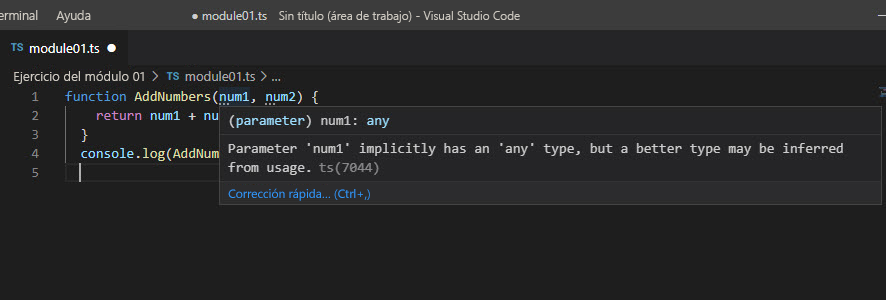

# Typescript Introduction

## Compilación de un archivo en TypeScript

Para ejecutar el compilador de TypeScript en el símbolo del sistema, use el comando tsc. Cuando ejecute tsc sin parámetros adicionales, compilará todos los archivos .ts en la carpeta actual y generará un archivo .js para cada uno.

También puede compilar un archivo específico. Por ejemplo, para compilar un archivo TypeScript denominado utility_functions.ts, escriba tsc utility_functions.ts.

> Nota:
>
> Es opcional escribir la extensión de archivo .ts.

Si no hay ningún error del compilador, el comando tsc genera un archivo JavaScript denominado utility_functions.js.

Si el compilador encuentra errores en el código, los muestra en la ventana de comandos. Corrija los errores del archivo TypeScript y vuelva a ejecutar el comando tsc.

## Opciones del compilador

Las opciones del compilador le permiten controlar cómo se genera el código JavaScript a partir del código TypeScript de origen. Puede establecer las opciones en el símbolo del sistema, como haría en el caso de muchas interfaces de la línea de comandos, o en un archivo JSON denominado tsconfig.json.

Hay disponibles numerosas opciones del compilador. Encontrará una lista completa de opciones en la documentación de las interfaces de la línea de comandos de tsc. Estas son algunas de las opciones más comunes:

- `noImplicitAny`
- `noEmitOnError`
- `target`
- Opciones de directorio

Para controlar la compilación, puede usar las opciones del compilador con el comando tsc, incluidas las siguientes:

- La opción `--noImplicitAny` indica al compilador que genere errores en expresiones y declaraciones con un tipo any implícito. Por ejemplo:\
`tsc utility_functions.ts --noImplicitAny`

- La opción `--target` especifica la versión de destino de ECMAScript para el archivo JavaScript. En este ejemplo se compila un archivo JavaScript compatible con ECMAScript 6:\
`tsc utility_functions.ts --target "ES2015"`

Descubrirá otras opciones del compilador en módulos posteriores.

## Generación de un archivo tsconfig.json

El compilador de TypeScript aplica el comportamiento predeterminado cuando se compila código fuente TypeScript. Aun así, es posible modificar las opciones del compilador de TypeScript si se agrega un archivo _tsconfig.json_ a la raíz de la carpeta del proyecto TypeScript. Este archivo define la configuración del proyecto de TypeScript, como las opciones del compilador y los archivos que deben incluirse.

Puede usar la opción `init` del compilador de TypeScript para generar un archivo TSConfig con opciones predeterminadas.

1. En Visual Studio Code, abra una nueva ventana del terminal. Para ello, seleccione Terminal>Nuevo terminal.

2. En el símbolo del sistema, escriba `tsc --init`.\
Observe que el nuevo archivo _tsconfig.json_ se ha agregado al panel del explorador. Es posible que tenga que actualizar el panel del explorador para ver el archivo.

3. Abra el archivo _tsconfig.json_ en el editor de código. Verá que ofrece numerosas opciones, muchas de las cuales están comentadas. Revise la descripción de cada opción habilitada.

4. En el archivo _tsconfig.json_, busque la opción de destino y cámbiela a `"ES2015"`.

5. Actualice el archivo tsconfig.json para que el compilador guarde todos los archivos JavaScript en una nueva carpeta.
    1. En el panel del explorador, cree una carpeta en el proyecto denominada build.
    2. En el archivo tsconfig.json, busque la opción `outDir`, quite el comentario y establezca el parámetro en build.

6. Guarde el archivo _tsconfig.json_.

7. En el símbolo del sistema, escriba `tsc`. Esto lee el archivo _tsconfig.json_ y restablece las opciones del proyecto.

> Sugerencia
>
>Para obtener más información sobre el archivo tsconfig.json, vea la referencia de TSConfig.

## Compilación de TypeScript en JavaScript

Vamos a agregar código JavaScript al archivo TypeScript y, luego, a compilarlo.

1. Copie y pegue el siguiente código JavaScript en el editor de **module01.ts**.

    ```javascript
    function addNumbers(x, y) {
    return x + y;
    }
    console.log(addNumbers(3, 6));
    ```

    Tenga en cuenta que, aunque todavía no ha compilado el código, Visual Studio Code ha usado su compatibilidad integrada con TypeScript para realizar una comprobación del tipo. Igual que antes, hay errores de tipo en los dos parámetros de la función `addNumbers`.

    

2. Actualice el código TypeScript para especificar un tipo para cada parámetro. Reemplace `x` por `x: number` y reemplace `y` por `y: number`.

3. Guarde el archivo TypeScript. El compilador de TypeScript solo funciona en la versión guardada del archivo.

4. En el símbolo del sistema del terminal, escriba `tsc module01.ts`. El compilador debería ejecutarse sin errores.

    Observe que se ha agregado un nuevo archivo JavaScript, pero no se encuentra en la carpeta build del explorador. Es posible que tenga que actualizar el panel del explorador para ver el archivo. Al ejecutar el comando tsc en un solo archivo, el compilador omite el archivo _tsconfig.json_.

5. Para cargar el archivo de configuración y compilar todos los archivos .ts de la carpeta, ejecute `tsc` sin ningún nombre de archivo. Esto debería agregar el archivo `.js` a la carpeta _build_. Recuerde eliminar el archivo .js adicional de la carpeta raíz.

6. Abra el archivo _module01.js_ y, luego, seleccione el botón Dividir editor a la derecha de la esquina superior derecha para abrir una nueva vista del editor.

    Ahora debería poder ver los archivos _.ts_ y _.js_ en paralelo. Tenga en cuenta que son idénticos, con la única diferencia de que el archivo _.js_ no incluye las nuevas anotaciones de tipo.

7. En el símbolo del sistema del terminal, escriba `node .\build\module01.js`. Esto ejecuta JavaScript y muestra el resultado en el registro de la consola.
