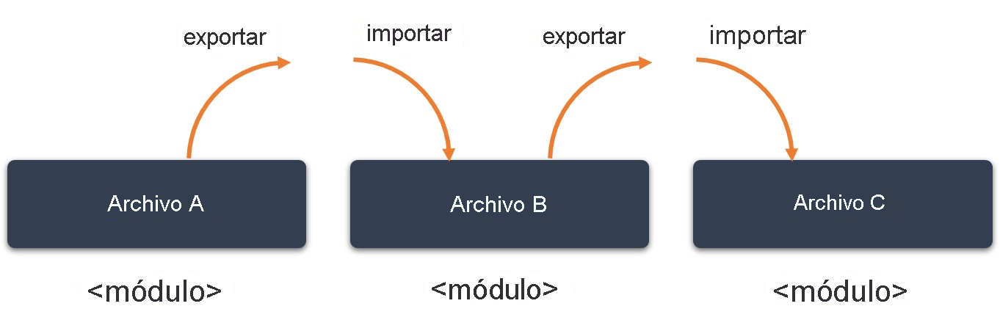

# Organización del código con módulos

## Tabla de Contenidos

## Introduccion

Los módulos proporcionan una forma de organizar y clasificar el código, lo que le permite agrupar el código relacionado. Además, cuando el código está dentro de un módulo, se extrae desde el ámbito global al ámbito del módulo. Esto puede ayudarle a evitar conflictos de nomenclatura entre los componentes del espacio de nombres global.

> Sugerencia
> 
> Los módulos han sido una característica de JavaScript desde ES6, por lo que también se admiten en TypeScript. Antes de ES6, las versiones anteriores de TypeScript hacían referencia a los módulos como "módulos externos".

Se puede exportar cualquier declaración (como una variable, una función, una clase, un alias de tipo o una interfaz) al agregar la palabra clave export o importarla mediante la palabra claveimport. Cualquier archivo que contenga una instrucción import o export de nivel superior se considera un módulo.

La instrucción export hace que un componente de un módulo esté disponible para otros módulos de forma explícita, mientras que la instrucción import permite consumir ese componente desde otro módulo. Los módulos son declarativos; las instrucciones importexport en el nivel de archivo describen las relaciones entre ellos.




## Exportación e importación de componentes de módulo

Veamos cómo organizar las declaraciones de función, variables, clases e interfaces en varios módulos y, después, usar estos componentes en el código.

> Nota
> 
> Debe usar un IDE, como Visual Studio Code, para implementar módulos. No es posible hacerlo en el área de juegos de TypeScript.

### Exportación de un componente de módulo

Para exportar un componente de módulo, use la palabra clave export.

En esta parte del ejercicio, organizará las funciones relacionadas en módulos independientes y luego exportará las declaraciones de función.

1. Abra una nueva área de trabajo de Visual Studio Code.
2. Cree un archivo llamado greetings_module.ts y, después, agregue la función siguiente denominada returnGreeting. Agregue la palabra clave export antes del nombre de la función para que esté disponible en otros módulos.
    ````typescript
    export function returnGreeting (greeting: string) {
        console.log(`The message from Greetings_module is ${greeting}.`);
    }
    ````
3. Cree un segundo archivo llamado greetings-utilities_module.ts y, después, agregue las dos funciones siguientes, returnGreeting y getLength, al archivo nuevo. Agregue export antes de la función returnGreeting para que esté disponible en otros módulos. No es necesario exportar la función getLength porque solo se utiliza en el ámbito del módulo.
    ````typescript
    export function returnGreeting (greeting: string) {
        let greetingLength = getLength(greeting);
        console.log(`The message from GreetingsLength_module is ${greeting}. It is ${greetingLength} characters long.`);
    }
    function getLength(message: string): number {
        return message.length
    }
    ````

### Importación de un componente de módulo

Para usar los componentes exportados de un módulo, utilice la instrucción import. La instrucción import puede adoptar varias formas en función de sus objetivos.

Para importar una exportación única desde un módulo, haga lo siguiente:

````typescript
import { <component name> } from '<module name>'
````

Para cambiar el nombre de una importación, use la palabra clave "as":

````typescript
import { <component name> as <new name> } from '<module name>'
````

Para importar el módulo completo en una sola variable y usarlo para acceder a las exportaciones de módulos, haga lo siguiente:

````typescript
import * as <variable name> from '<module name>'
````

En la siguiente parte del ejercicio, importará los componentes de cada uno de los dos módulos en un nuevo módulo.

1. Cree un archivo denominado main.ts. Este archivo contendrá el código principal de la aplicación, incluidas las instrucciones import.
2. Importe la función returnGreeting desde greetings_module.ts mediante la palabra clave import.
    ````typescript
    import { returnGreeting } from './greetings_module.js';         // imports a single function in the module
    ````
3. Si greetings_module.ts hubiera contenido varios componentes, podría importar todo el módulo en una sola variable (por ejemplo, allGreetingFunctions), tal como se muestra en la instrucción siguiente. Después, puede usar la variable para acceder a todas las exportaciones de módulos.
    ````typescript
    import * as allGreetingFunctions from './greetings_module.js';  // imports all exported components in the module
    ````
4. Intente importar la función returnGreeting desde greetings-utilities_module.ts mediante la instrucción import { returnGreeting } from './greetings-utilities_module.js'. Observará un error porque ambos archivos contienen una función returnGreeting y ahora tiene un conflicto de nomenclatura en el ámbito global de main.ts.
5. Corrija el conflicto de nomenclatura; para ello, asigne un nombre nuevo a la segunda instancia de returnGreeting. Reemplace { returnGreeting } por { returnGreeting as returnGreetingLength }. Ahora puede usar returnGreetingLength en lugar del nombre de función en el código.
    ````typescript
    import { returnGreeting as returnGreetingLength } from './greetings-utilities_module.js';
    ````
   > Importante
   > 
   > Si quiere ejecutar el código de JavaScript resultante en un explorador web, debe anexar la extensión de archivo .js al nombre de archivo en la instrucción import. Para obtener más información, vea La importación de JavaScript compilada no encuentra la extensión de archivo.
6. Ahora, puede usar las funciones returnGreetings del código.
    ````typescript
    returnGreeting('Hola!')  // Displays 'The message from Greetings_module is Hola!'
    allGreetingFunctions.returnGreeting('Bonjour');  // Displays 'The message from Greetings_module is Bonjour!'
    returnGreetingLength('Ciao!');  // Displays 'The message from GreetingsWithLength_module is Ciao! It is 5 characters long.'
    ````
